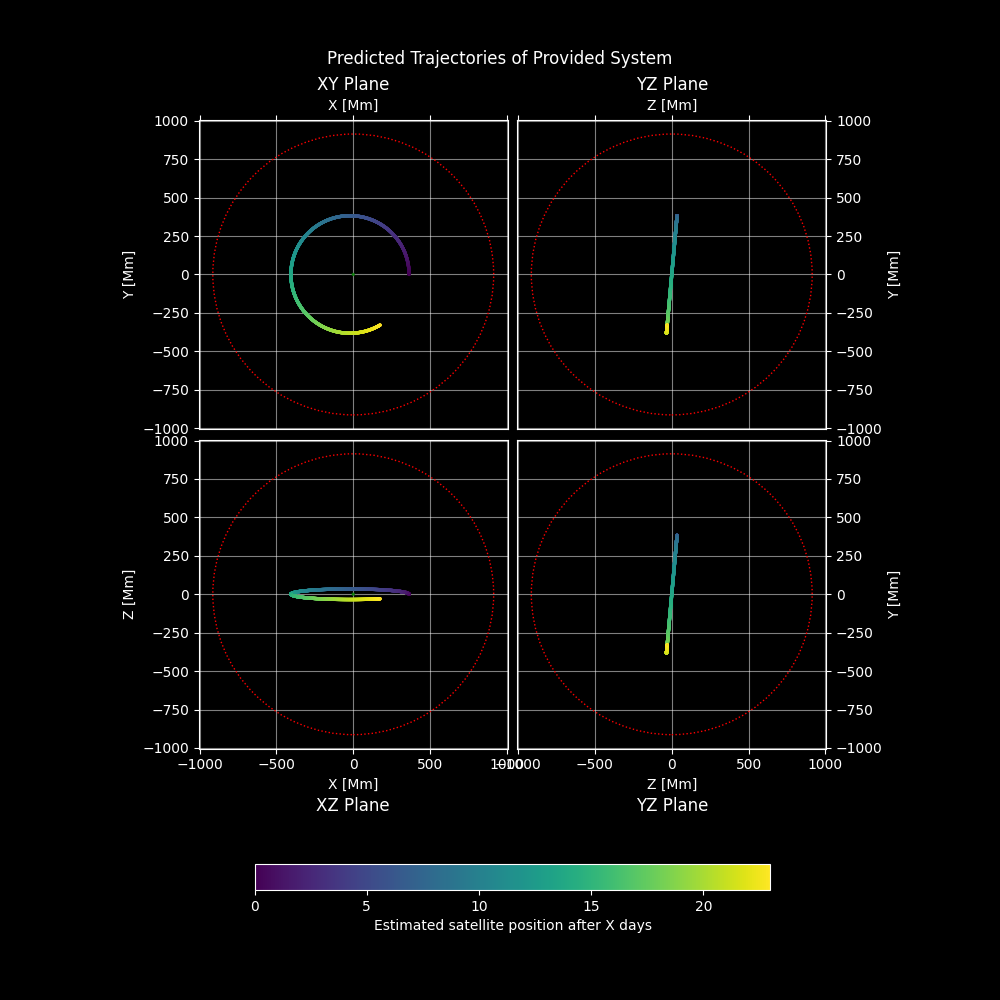
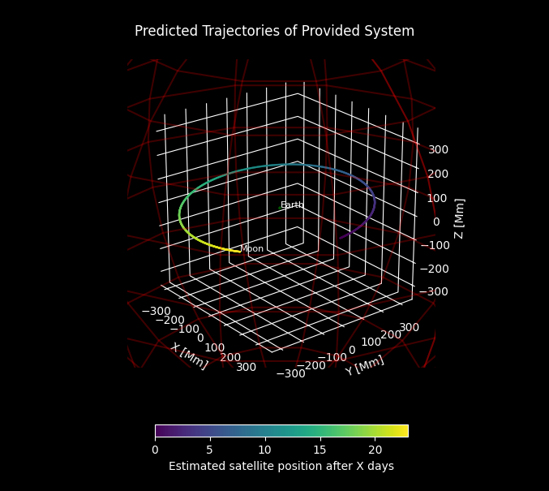
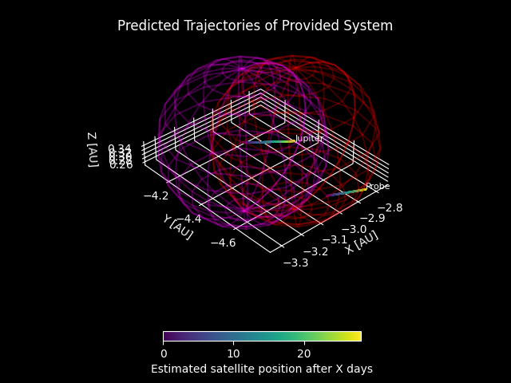
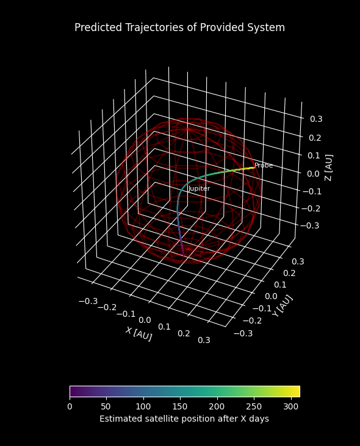
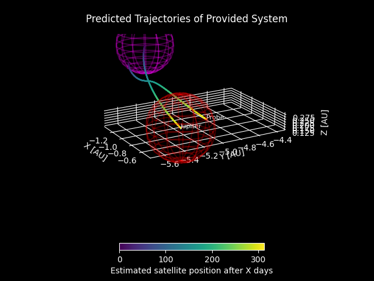
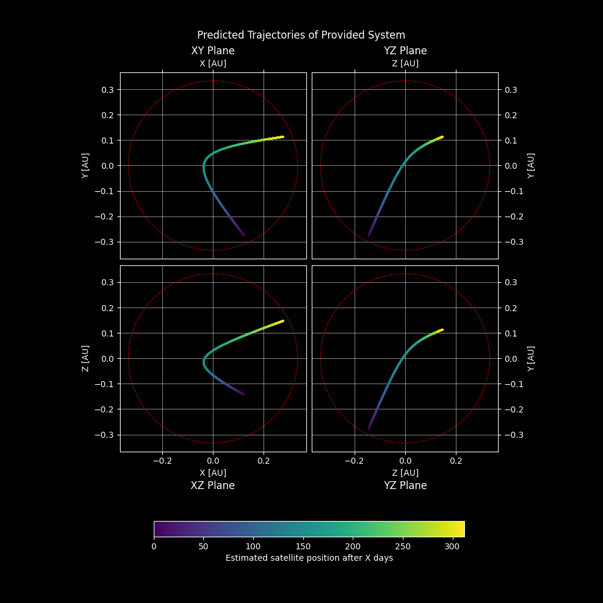
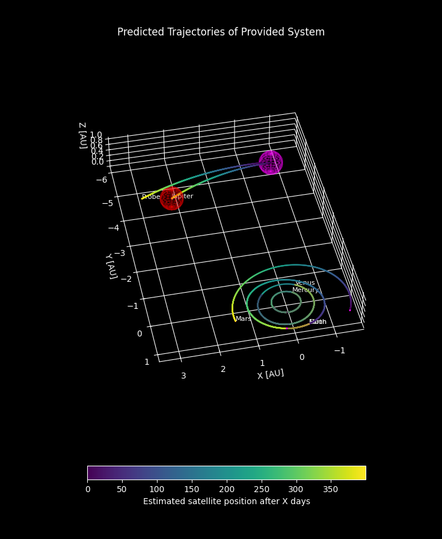
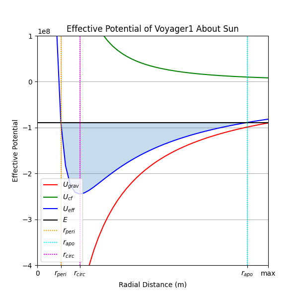

# Astrodynamics

##### Table of Contents
- [Astrodynamics](#astrodynamics)
  * [Description](#description)
  * [Introduction](#introduction)
  * [Installation](#installation)
  * [Getting started](#getting-started)
    + [Quick start](#quick-start)
    + [Start from scratch](#start-from-scratch)
  * [Example of an encounter with Jupiter](#example-of-an-encounter-with-jupiter)
  * [Limitations](#limitations)
  * [Future goals](#future-goals)
  * [How to contribute](#how-to-contribute)
  * [License](#license)

<small><i><a href='http://ecotrust-canada.github.io/markdown-toc/'>Table of contents generated with markdown-toc</a></i></small>

<a name="description"/> 

## Description 

Astrodynamics is a small, self-contained set of objects and functions specifically designed for the exploration and modeling of various orbital trajectories and their interactions. Particularly intended for use in a notebook environment, Astrodynamics is especially useful for defining different kinds of orbital trajectories and simulation of the motion of both planets and arbitrary spacecraft. This collection  of Python functions and classes contains numerous useful methods for modeling different trajectories and associated variables, descriptors, constants, and more. 

<a name="introduction"/>

## Introduction 

This project was first embarked on in the spring of 2022 as part of a final project for one of my physics courses. Having long been curious about the physical mechanics of a spacecraft undergoing a [gravity assist](https://en.wikipedia.org/wiki/Gravity_assist) (like *Voyager*, *MESSENGER*, and *Cassini-Huygens*, to name a few), I wanted to try my hand at modeling the counter-intuitive phenomenon for myself. The very first iteration of this project was a simplified look into the very basics of a gravity assist and thus only considered two dimensions. 

While two dimensions sufficed for a simple examination of a complex phenomenon and demonstrated a gravity assist even better than I had initially hoped, it just wasn't good enough for me. So, I started from scratch, and changed my whole approach toward an object-oriented model.

For cases where a satellite enters or exits the gravitational [sphere of influence](https://en.wikipedia.org/wiki/Sphere_of_influence_(astrodynamics)) of another satellite, the new trajectory of the satellite will be assessed using a [patched conic approximation](https://en.wikipedia.org/wiki/Patched_conic_approximation).

<a name="installation"/>

## Installation 

Astrodynamics' only dependencies are standard Python libraries like NumPy, SciPy, and Matplotlib, so installation is pretty straightforward. Just download `Astrodynamics.py` to the root of your project or use git commands in a terminal. All that's left is to import it into a project.

<a name="getting-started"/>

## Getting started

The easiest way to get started with Astrodynamics is closest to home, with the Earth, Moon, and Sun:

<a name="quick-start"/>

### Quick start 

There are four shortcut functions to create a system: `solar_system()`, `inner_planets()`, `outer_planets()`, and `earth_moon()`. Each has an optional keyword argument `inclination` for defining a reference plane for the inclination angles[^inclination].

```python
from Astrodynamics import earth_moon
import Astrodynamics as adx

# Create a System object with the Earth, Sun, and Moon
ems = earth_moon(inclination="ecliptic")
```

One can alter any orbital property by using any of the class methods of a `Satellite` object:

```python
# Change Earth's true anomaly
ems.satellites["Earth"].set_true_anomaly(45)
```

Now we can simulate the Earth-Moon system for 23 days and plot the motion of the Moon around the Earth:

```python
ems.satellites["Earth"].plot_simulation("planar", scale="Mm")
```
> 

<a name="start-from-scratch"/>

### Start from scratch

Starting from scratch is understandably more involved than what was discussed in the previous section.

```python
import Astrodynamics as adx

sun = {"name": "Sun",
       "color": "yellow", # Not required, but nice to have for plotting
       "radius": 6.957e+8,
       "mass": 1.98847e+30}
earth = {"name": "Earth", 
         "color": "g",
         "e": 0.0167086,
         "a": 149598023000, 
         "inc": {"sun_eq": 7.155,
                 "ecliptic": 0.00005,
                 "invariable_plane": 1.57869},
         "long_asc_node": -11.26064, 
         "arg_periapsis": 114.20783, 
         "radius": 6371000, 
         "mass": 5.97217e+24}
moon = {"name": "Moon",
        "color": "grey",
        "e": 0.0549, 
        "a": 384399000, 
        "inc": {"sun_eq": 0,
                "ecliptic": 5.145,
                "invariable_plane": 0},
        "radius": 1737400,
        "mass": 7.342e22}
        
# Create a System object with the Earth, Sun, and Moon
Sun = adx.Body(sun)
ems = adx.System(Sun, sun, inclination="ecliptic")
ems.add_satellite(adx.Body(earth), earth)
ems.satellites["Earth"].add_satellite(adx.Body(moon), moon)
```

While the arguments for `Body` and `add_satellite` must be dictionaries, they are not required to contain *all* of the information in the dictionaries seen above, but name and mass must be defined. Unspecified elements are generally defaulted to zero. Again, we can simulate the trajectory of the Moon for 23 days and instead display a 3d plot, again with the Earth's gravitational sphere of influence:

```python
ems.satellites["Earth"].simulate(23)
ems.satellites["Earth"].plot_simulation("3d", scale="Mm")
```
> 

[^inclination]: 
`"sun_eq"` for inclination relative to the Sun's equator (default)  
`"ecliptic"` for inclination relative to the [ecliptic](https://en.wikipedia.org/wiki/Ecliptic)  
`"invariable_plane"` for inclination relative to the [invariable plane](https://en.wikipedia.org/wiki/Invariable_plane)

<a name="example-of-an-encounter-with-jupiter"/>

## Example of an encounter with Jupiter 

To demonstrate how Astrodynamics works with interplanetary encounters, I have manufactured an encounter between Jupiter and an arbitrary probe object with negligible mass.

```python
import numpy as np
import Astrodynamics as adx
from Astrodynamics import inner_planets, encounter, escape

AU = 149597871000
pos = np.array([-7.86614423e+11+AU/2, -2.01278847e+11+AU , 8.64304557e+10])
vel = np.array([3074.33691241, 12052.98083353, -89.00020202])

enc = inner_planets()
enc.add_satellite(adx.Body({"name":"Probe", "mass":543}, negligible=True), {"position":pos, "velocity":-vel})
enc.add_satellite(adx.Body(jupiter), jupiter)
enc.satellites["Probe"].set_true_anomaly(187.8)
enc.satellites["Jupiter"].set_true_anomaly(220)
enc.satellites["Probe"].set_velocity(np.array([ 8660.62219213, -4696.66266911, 18.9300877 ]))
enc.simulate(30, timestep="days")
enc.plot_simulation('3d')
```
> Encounter found between Jupiter and Probe at time 28.064806480648063 days
> 

With the knowledge that the probe enters Jupiter's sphere of influence shortly after 28 days of simulation time, the simulation automatically stops as soon as there is an encounter, impact, or escape detected (provided all `check_` keyword arguments are `True`). The next step then is to make the patched conic approximation and simulate the hyperbolic trajectory the probe takes around Jupiter:

```python
probe, jupiter = enc.satellites["Probe"], enc.satellites["Jupiter"]
hyp = encounter(jupiter, probe)
hyp.simulate(315)
hyp.satellites["Jupiter"].plot_simulation("3d")
```
> Satellite Probe escapes primary Jupiter at time 312.2277227722772 days
> 

Adjusting the angle of the 3D plot can better display the change in trajectory relative to the Sun:
> 

An equivalent visualization of this trajectory can be displayed by changing the argument in the `plot_simulation` method:

```python
hyp.satellites["Jupiter"].plot_simulation("planar")
```
> 

Given that the probe escapes Jupiter's SOI, the new trajectory is again determined by making the patched conic approximation:

```python
probe, jupe = hyp.satellites["Jupiter"].satellites["Probe"], hyp.satellites["Jupiter"]
esc = escape(jupe, probe)
esc.simulate(400)
esc.plot_simulation("3d")
```
> 

The difference in the probe's trajectory probably isn't too apparent, considering the initial trajectory was only simulated for a short time and the awkward 3d plot angle from earlier, so here's a comparison of the pre- and post-assist trajectories:

| Element          | Pre-assist           | Post-assist          | Difference           |
| ---------------- |:--------------------:|:--------------------:| --------------------:|
| semi-major axis  | 3.99396 AU           |  8.79155 AU          |  4.79759 AU          |
| eccentricity     | 0.39671194           |  0.41555246          |  0.01884052          |
| inclination      | 2.6278306°           |  3.8009806°          |  1.1731499°          |
| arg periapsis    | 257.78166°           |  109.95140°          | -147.83026°          |
| long. asc. node  | 153.92832°           |  162.03471°          |  8.1063864°          |
| true anomaly     | 185.93823°           |  352.03689°          |  166.09866°          |

To add, the effective potential of any orbital trajectory can also be visualized with plotting the orbit's effective potential. While this is technically not part of the same example, I'm just going to toss it in here using the example of the trajectory of [Voyager 1 en-route to Jupiter](https://voyager.jpl.nasa.gov/mission/science/hyperbolic-orbital-elements/):

```python
import Astrodynamics as adx
from Astrodynamics import earth_moon

voyager1 = {"a": 745761e6, 
            "e": 0.797783}
solsys = earth_moon()
solsys.add_satellite(adx.Body({"name": "Voyager1", "mass": 123}, negligible=True), voyager1)
solsys.satellites["Voyager1"].plot_potential(y_window=[-4e8, 1e8])
```
> 

<a name="limitations"/>

## Limitations 

Astrodynamics has several noteworthy limitations:
- Any change in trajectory (with the exception of escape and encounter trajectories) is considered to be instantaneous, and thus the Oberth effect and other specific phenomena are not accounted for.
- It is assumed that the relationship between the masses of a primary body and a satellite are significantly different and distant enough that a two-body system has a [barycenter](https://en.wikipedia.org/wiki/Barycenter_(astronomy)) effectively located at the position of the primary. Thus, Astrodynamics is not suited for modeling systems like the [Pluto-Charon system](https://en.wikipedia.org/wiki/Charon_(moon)#Orbit), binary star systems, and the [N-body problem](https://en.wikipedia.org/wiki/N-body_problem).
- For large systems (those with many satellites), predicting the trajectory of many satellites can take a bit of time, depending on both the type of trajectory being simulated and the resolution of the time frame being simulated.
- It is assumed that trajectories are on a scale where relativistic effects are negligible. Therefore, velocities in excess of the speed of light are *technically* allowed to occur.
- Trajectories do not yet take into consideration reference [epochs](https://en.wikipedia.org/wiki/Epoch_(astronomy)), though the included data for the planets of the Solar System is assumed to be with respect to [epoch J2000](https://en.wikipedia.org/wiki/Epoch_(astronomy)#Julian_years_and_J2000).

<a name="future-goals"/>

## Future goals

Most goals for the future are related to the above section. 

- Runtime optimization for systems with many satellites. Depending on both the resolution of a simulation and the number of satellites being simulated, computations can take a few seconds. There is most likely a way to perform some computations in parallel or through vectorization and avoiding loops where possible.
- Astrodynamics currently has no solid method for setting both Keplerian orbital elements and a state vector simultaneously. Furthermore, I don't yet know of a good way to ensure certain elements *can* carry-over to precise element changes, particularly verifying whether certain existing and desired elements lie along the same plane formed by the Euler angles. Currently an original position vector can be reused only when the semi-major axis and/or eccentricity is changed, but only if the original position is possible given the new apsides.
- Problems with inclination being tied to the values of other Euler angles (argument of periapsis, longitude of ascending node) means flipping the inclination of one orbit to invert the direction of the specific angular momentum vector (and thereby making a defined clockwise orbit instead move counter-clockwise) can sometimes produce unexpected results.
- In the future, I hope to implement some method for keeping track of [delta-v](https://en.wikipedia.org/wiki/Delta-v) considerations at various points along a trajectory. Moreover, this should coincide with more precise editing of an object's trajectory (plane changes, Hohmann transfers, etc.).
- Maybe create another markdown file detailing the physics and calculations involved in determining Kepelrian elements, state vectors, and predicting satellite motion?

<a name="how-to-contribute"/>

## How to contribute 

When I first started this project for my university physics course, I had no (immediate) intention to take it much further, certainly not to the degree where I would make it public and put it on GitHub. Admittedly, the only reason any of this is here on GitHub is because it wasn't originally good enough for *me*. I wanted to create something I could use to model the phenomenon while *proving to myself* I understood the mechanics.

And then, I just didn't want to stop. There will always be improvements to make and new Python techniques and strategies to learn and master. As with anyone, I do have my limits, which brings me to the penultimate section of this file:

Any and all contributions to this project are not only **welcomed** but ***invited***! I am always looking for ways to improve upon and perfect this project. Please feel free to contact me via LinkedIn or my email with any ideas, suggestions, bug fixes, anything! 

*Most importantly,* ***thank you!***

---
<a name="license"/>

## License 
MIT License

Copyright (c) 2022-2024 Evan Bauer

Permission is hereby granted, free of charge, to any person obtaining a copy
of this software and associated documentation files (the "Software"), to deal
in the Software without restriction, including without limitation the rights
to use, copy, modify, merge, publish, distribute, sublicense, and/or sell
copies of the Software, and to permit persons to whom the Software is
furnished to do so, subject to the following conditions:

The above copyright notice and this permission notice shall be included in all
copies or substantial portions of the Software.

THE SOFTWARE IS PROVIDED "AS IS", WITHOUT WARRANTY OF ANY KIND, EXPRESS OR
IMPLIED, INCLUDING BUT NOT LIMITED TO THE WARRANTIES OF MERCHANTABILITY,
FITNESS FOR A PARTICULAR PURPOSE AND NONINFRINGEMENT. IN NO EVENT SHALL THE
AUTHORS OR COPYRIGHT HOLDERS BE LIABLE FOR ANY CLAIM, DAMAGES OR OTHER
LIABILITY, WHETHER IN AN ACTION OF CONTRACT, TORT OR OTHERWISE, ARISING FROM,
OUT OF OR IN CONNECTION WITH THE SOFTWARE OR THE USE OR OTHER DEALINGS IN THE
SOFTWARE.
